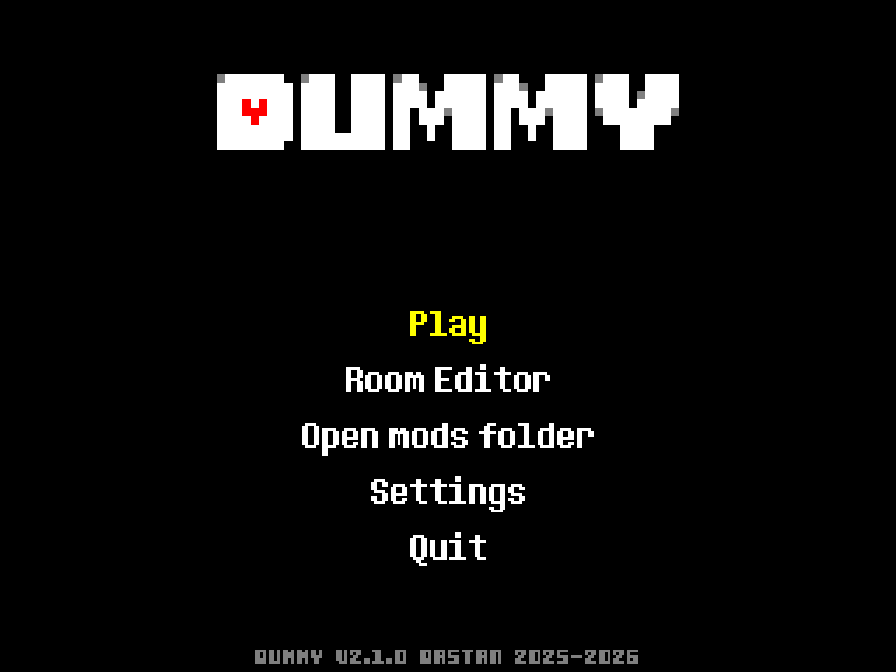
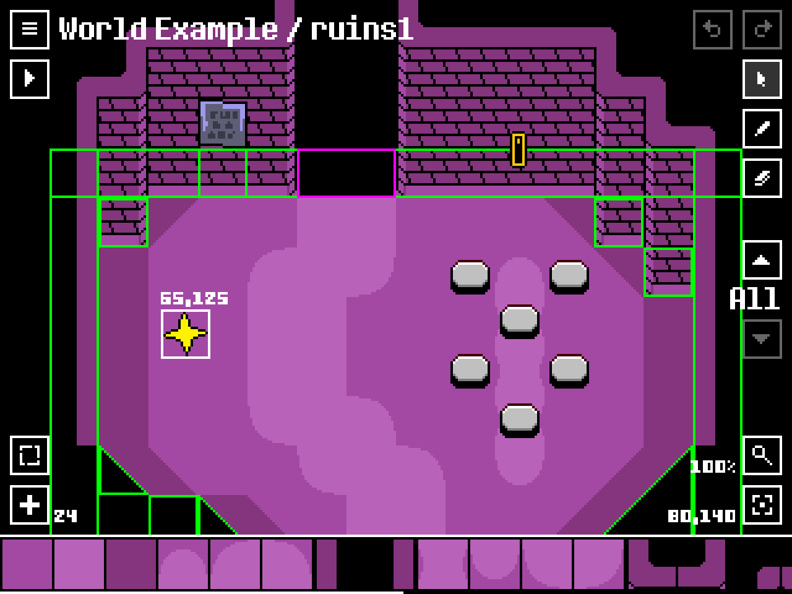

# DUMMY

DUMMY is an [UNDERTALE](https://undertale.com) fangame engine, made with [LÖVE](https://love2d.org/).

You can make custom UNDERTALE worlds and battles.

DUMMY's main menu

DUMMY's room editor

## Download

Get the latest release [here](https://github.com/Dastan21/DUMMY/releases).

## Adding mods

Mods are located in the `mods` folder in the save directory (open the engine and select the option `Open mods folder`).

Folders and ZIP files are supported.

## Localization

The game supports i18n, you can change the language in the settings menu.

If you want to add a new language, you can do it by adding a new file in the `assets/langs` folder.

Any new language contribution or correction is welcome.

## Standalone

If you want to share your mod as a standalone:

1. In your `mod.lua`, set `standalone = true` in the mod constructor ;
2. Open `DUMMY.exe` or `DUMMY.love` as a ZIP archive ;
3. Copy your mod folder into the `mods` folder.

## Credits

Some assets are from [UNDERTALE](https://undertale.com) by Toby Fox.

Project inspired by [Kristal](https://github.com/KristalTeam/Kristal) and [CreateYourFrisk](https://github.com/RhenaudTheLukark/CreateYourFrisk).
